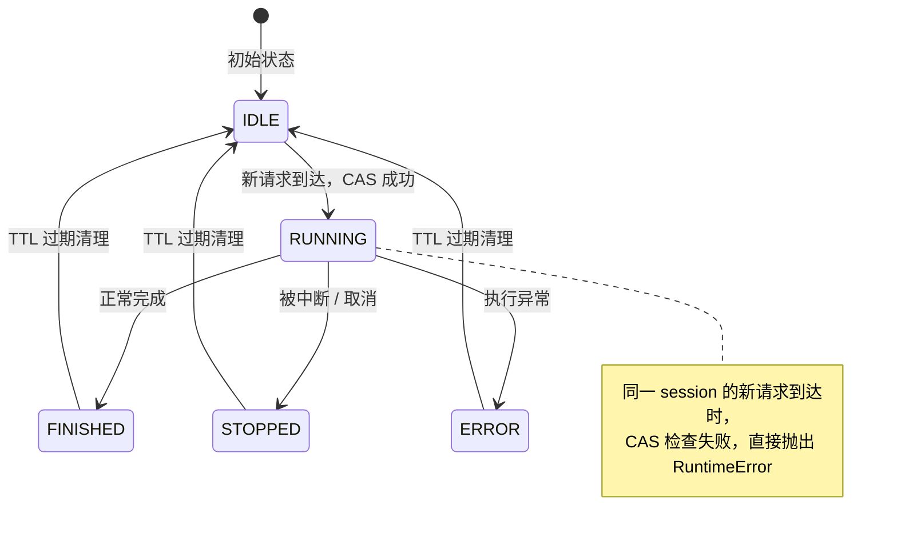
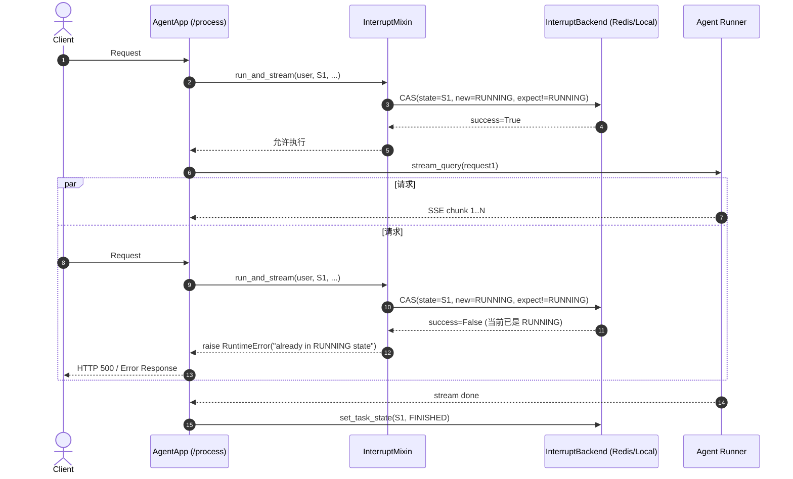
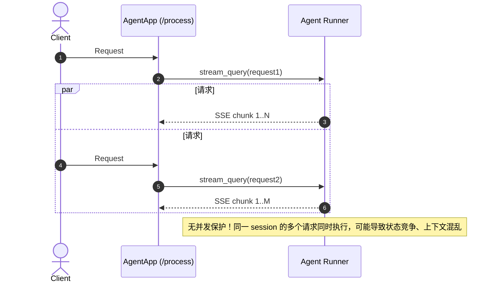
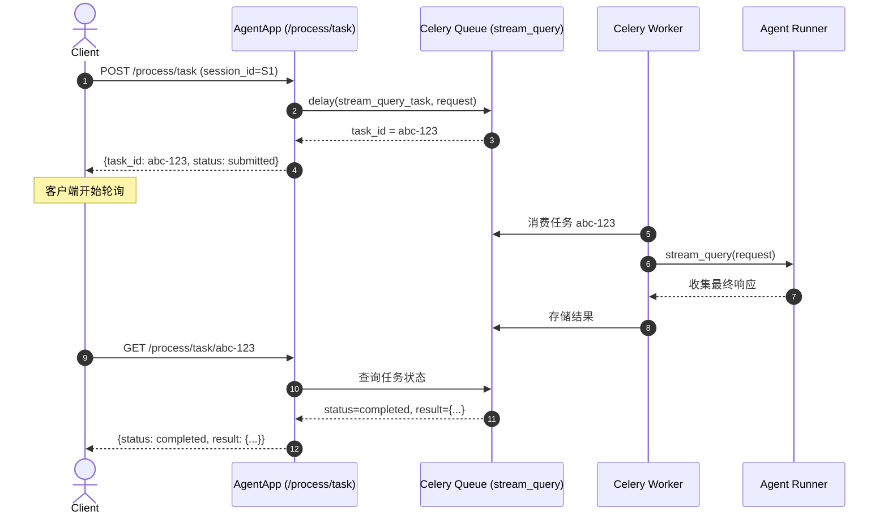

# AgentScope Runtime 对话排队与并发控制机制调查报告

> **调查时间**: 2026年  
> **调查对象**: AgentScope Runtime (agentscope-ai/agentscope-runtime)  
> **调查范围**: 源码级分析，重点聚焦 `AgentApp` 请求处理、会话（session）并发控制、任务队列机制  
> **版本参考**: v1.1.0+ (main branch)

---

## 1. 框架概述

AgentScope Runtime 是一个面向 AI Agent 应用的生产级全栈运行时，核心使命是 **Agent as a Service (AaaS)**。它将 Agent 应用封装为可通过标准 API 访问的流式服务，核心能力包括：

- **Tool Sandboxing**: 安全隔离的工具执行环境
- **AaaS APIs**: 基于 FastAPI 的流式 SSE 服务接口
- **Scalable Deployment**: 本地、Serverless、K8s 弹性部署
- **Full Observability**: 日志、链路追踪（OTel）
- **Framework Compatibility**: 支持 AgentScope、AutoGen、Agno、LangGraph 等框架

AgentScope Runtime 的请求入口是 `AgentApp`（继承自 FastAPI），它负责接收 HTTP 请求并调用内部 `Runner` 执行 Agent 推理。

---

## 2. 调查问题

**核心问题**: AgentScope Runtime 是否支持"对话排队"？

这里的"对话排队"通常指：当同一个 session（或同一个用户）在短时间内发起多次对话请求时，框架能否自动将这些请求按顺序排队，避免并发冲突，确保一个 session 的请求串行执行。

---

## 3. 核心发现

经过对源码的深入分析，得出以下三个关键结论：

### 结论一：框架不内置"同一 Session 的 FIFO 排队等待"机制

AgentScope Runtime **没有实现**一个显式的、基于队列的排队系统，用于让同一 session 的请求按到达顺序排队并依次执行。开发者不能在配置中直接开启"session 对话排队"功能。

### 结论二：框架提供 Session 级并发互斥（拒绝重复请求），但需手动启用

`AgentApp` 在 `v1.1.0` 重构后引入了 **Distributed Interrupt Service**，通过 `InterruptMixin` 的 `run_and_stream` 方法实现基于 `user_id + session_id` 的任务状态原子检查。

- 当启用 `interrupt_backend`（如 `RedisInterruptBackend` 或 `LocalInterruptBackend`）时，框架会对同一个 session 的并发请求进行**互斥保护**。
- 若该 session 已有请求正在执行（`RUNNING` 状态），新请求会直接抛出 `RuntimeError`，**被拒绝**，而非排队等待。

### 结论三：框架提供异步后台任务队列，但服务于"任务分发"而非"会话串行化"

通过 `enable_stream_task=True` 和可选的 Celery 集成，框架支持将流式查询作为后台任务提交到指定队列（如 `stream_query`）。

- 这解决了"长耗时请求不阻塞 HTTP 连接"的问题。
- 它利用的是通用任务队列（Celery / Redis / In-Memory），**并不保证同一 session 的任务按顺序执行**。如果多个 Worker 消费队列，同一 session 的多个任务仍可能被并发处理。

---

## 4. 机制详解

### 4.1 Distributed Interrupt Service — Session 级互斥

#### 源码位置
- `src/agentscope_runtime/engine/deployers/utils/service_utils/interrupt/interrupt_mixin.py`
- `src/agentscope_runtime/engine/app/agent_app.py`（`_stream_generator_with_interrupt` 调用入口）

#### 核心逻辑

```python
# interrupt_mixin.py — run_and_stream 方法

task_id = self._get_interrupt_key(user_id, session_id)  # 格式: "user_id:session_id"

# 原子检查：仅当当前状态不是 RUNNING 时才允许执行
success = await self._interrupt_backend.compare_and_set_state(
    key=task_id,
    new_state=TaskState.RUNNING,
    expected_state=TaskState.RUNNING,
    negate=True,  # 关键：当前 != RUNNING 时才成功
    ttl=3600,
)

if not success:
    raise RuntimeError(f"Task {task_id} is already in RUNNING state.")
```

#### 状态机流转



#### 时序图：启用 Interrupt Backend 的并发场景



#### 时序图：未启用 Interrupt Backend 的并发场景



### 4.2 异步后台任务队列 — Background Task Queue

#### 源码位置
- `src/agentscope_runtime/engine/app/agent_app.py`（`_add_stream_query_task_endpoint`）
- `src/agentscope_runtime/engine/app/celery_mixin.py`
- `src/agentscope_runtime/common/collections/`（`base_queue.py`, `in_memory_queue.py`, `redis_queue.py`）

#### 核心逻辑

当 `enable_stream_task=True` 时，`AgentApp` 会注册两个额外端点：

```
POST /process/task      → 提交流式查询作为后台任务
GET  /process/task/{id} → 轮询任务状态和最终结果
```

**Celery 模式**（配置了 `broker_url`）:
```python
result = self._stream_query_celery_task.delay(request)
return {
    "task_id": result.id,
    "status": "submitted",
    "queue": self.stream_task_queue,  # 默认 "stream_query"
    ...
}
```

**In-Memory 模式**（未配置 Celery）:
```python
asyncio.create_task(
    self.execute_stream_query_task(
        task_id=task_id,
        stream_func=self._runner.stream_query,
        request=request,
        queue=self.stream_task_queue,
        timeout=self.stream_task_timeout,
    )
)
```

#### 时序图：后台任务提交流程



---

## 5. 总结对比表

| 能力维度 | 是否支持 | 实现方式 | 行为特征 |
|---------|---------|---------|---------|
| **同一 Session 的 FIFO 顺序排队** | ❌ 不直接支持 | 无内置实现 | 框架不会自动将同一 session 的多个请求放入队列并按顺序依次执行 |
| **同一 Session 的并发互斥（拒绝）** | ✅ 支持 | `Distributed Interrupt Service` | 需显式启用 `interrupt_backend`；同一 session 的并发新请求会收到 `RuntimeError` 拒绝 |
| **异步后台任务队列** | ✅ 支持 | Celery / Redis / In-Memory | `enable_stream_task=True` 开启；解决 HTTP 长连接阻塞问题，但不保证 session 级串行 |
| **同一 Session 的串行执行（排队）** | ⚠️ 需自行实现 | 应用层逻辑 | 可在 `query_func` 内通过 Redis 分布式锁 + 队列手动实现排队 |

---

## 6. 结论与建议

### 6.1 结论

AgentScope Runtime **并非为"同一 session 的对话请求自动排队"而设计**。它的并发控制哲学是：

1. **保护会话状态一致性**：通过 `InterruptMixin` 防止同一 session 的请求并发执行导致的状态混乱。
2. **快速失败而非排队等待**：当检测到 session 正在处理中时，直接拒绝新请求，让客户端自行决定重试策略。
3. **解耦任务执行与 HTTP 连接**：通过后台任务队列将长耗时计算与 HTTP 响应解耦，提升服务吞吐量。

### 6.2 给开发者的建议

如果你需要在 AgentScope Runtime 上实现"同一 session 的对话排队"，可参考以下方案：

#### 方案 A：客户端侧排队（推荐）

在客户端维护每个 session 的请求队列。收到服务端 `RuntimeError("already in RUNNING state")` 后，自动延迟重试。实现简单，无服务端侵入。

#### 方案 B：应用层服务端排队

在自定义的 `query_func` 内部，基于 Redis 的分布式锁 + List/Stream 实现排队：

```python
@app.query(framework="agentscope")
async def query_func(self, msgs, request: AgentRequest, **kwargs):
    session_id = request.session_id
    lock_key = f"lock:session:{session_id}"
    queue_key = f"queue:session:{session_id}"

    # 1. 将请求加入队列
    await redis.lpush(queue_key, json.dumps(msgs))

    # 2. 尝试获取分布式锁（非阻塞）
    acquired = await redis.set(lock_key, "1", nx=True, ex=60)
    if not acquired:
        return {"status": "queued", "position": await redis.llen(queue_key)}

    # 3. 串行处理队列中的请求
    try:
        while True:
            item = await redis.rpop(queue_key)
            if item is None:
                break
            # 调用实际 Agent 逻辑
            async for msg, last in stream_printing_messages(agent, json.loads(item)):
                yield msg, last
    finally:
        await redis.delete(lock_key)
```

#### 方案 C：Celery 单 Worker 串行化

将 `stream_query` 注册为 Celery 任务，并为每个 session 分配**独立的队列**（如 `queue=f"session_{session_id}"`），每个队列只配置 1 个 Worker。这能间接实现 session 级的串行执行，但管理复杂度高。

---

## 7. 参考源码

| 文件路径 | 说明 |
|---------|------|
| `src/agentscope_runtime/engine/app/agent_app.py` | AgentApp 主类，请求路由、流式响应、后台任务端点 |
| `src/agentscope_runtime/engine/deployers/utils/service_utils/interrupt/interrupt_mixin.py` | Distributed Interrupt Service 核心逻辑 |
| `src/agentscope_runtime/engine/app/celery_mixin.py` | Celery 异步任务队列集成 |
| `src/agentscope_runtime/common/collections/base_queue.py` | 队列抽象接口 |
| `src/agentscope_runtime/common/collections/redis_queue.py` | Redis 队列实现 |
| `src/agentscope_runtime/common/collections/in_memory_queue.py` | 内存队列实现 |
| `cookbook/en/agent_app.md` | AgentApp 使用文档（Celery 章节） |

---

> **备注**: 以上分析基于 2026 年 AgentScope Runtime main 分支的源码。框架处于活跃迭代中（v1.1.0 刚完成重大架构重构），后续版本可能引入新的排队机制，建议持续关注 [CHANGELOG](https://github.com/agentscope-ai/agentscope-runtime/blob/main/CHANGELOG.md) 和 [Issues](https://github.com/agentscope-ai/agentscope-runtime/issues)。
