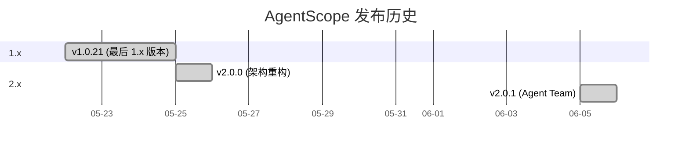
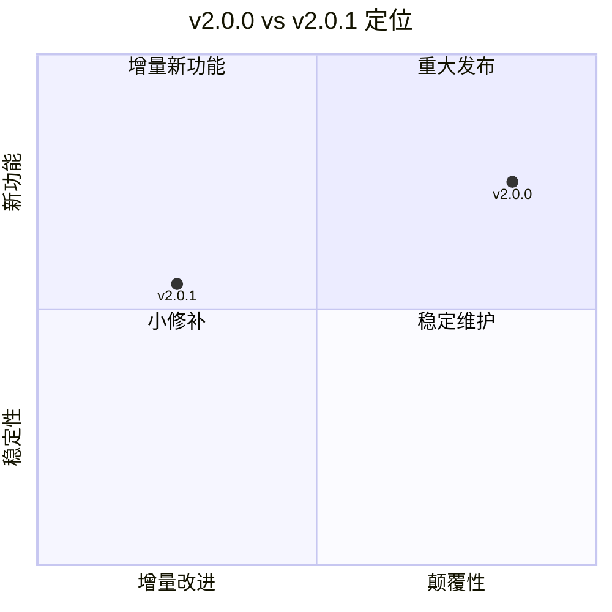
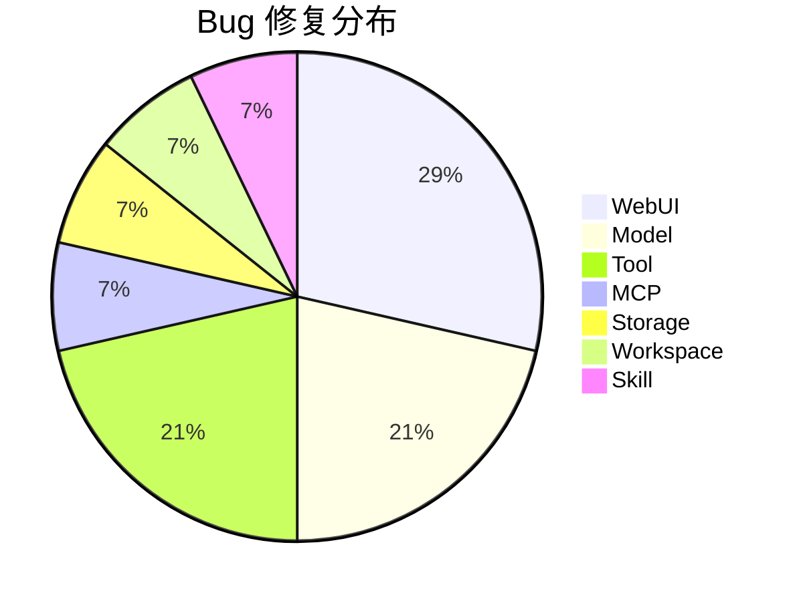

# AgentScope 2.0.0 vs 2.0.1 差异分析

**日期:** 2025-07-14
**来源:** GitHub Releases、GitHub Compare、官方 Docs Changelog

---

## 版本时间线

- **v2.0.0** (2025-05-25): 大版本发布，架构全面重构
- **v2.0.1** (2025-06-05): 补丁发布，间隔 11 天
  - 25 commits · 251 文件变更 · 14 贡献者
  - Source: [GitHub Compare](https://github.com/agentscope-ai/agentscope/compare/v2.0.0...v2.0.1)

---

## 版本性质对比

| 维度 | v2.0.0 | v2.0.1 |
|------|--------|--------|
| 性质 | 大版本发布 | 补丁/小特性发布 |
| 核心主题 | 架构重构 | 稳定+补全 |
| 贡献者 | 2 人 | 14 人（7 位新贡献者） |
| 文件变更 | ~40+ PR | 251 文件 |

---

## v2.0.1 所有变更一览

### ⭐ Highlight: Agent Team

重构 Agent Service 以支持多智能体团队协作（PR [#1776](https://github.com/agentscope-ai/agentscope/pull/1776)）。

### 新增功能

| 功能 | 模块 | PR | 贡献者 |
|------|------|----|--------|
| RAG 基础类 | rag | [#1746](https://github.com/agentscope-ai/agentscope/pull/1746) | @DavdGao |
| Web UI 回退模型 | webui | [#1699](https://github.com/agentscope-ai/agentscope/pull/1699) | @DavdGao |
| 模型 client_kwargs | model | [#1659](https://github.com/agentscope-ai/agentscope/pull/1659) | @qbc2016 |
| 主流模型 YAML 配置 | model | [#1731](https://github.com/agentscope-ai/agentscope/pull/1731) | @MannXo |
| EventBase 元数据 | event | [#1788](https://github.com/agentscope-ai/agentscope/pull/1788) | @qbc2016 |
| ripgrep 可选依赖 | deps | [#1740](https://github.com/agentscope-ai/agentscope/pull/1740) | @Oxygen56 |

### 性能改进

- **Service 层**: 支持额外 tools 和 middlewares（[#1709](https://github.com/agentscope-ai/agentscope/pull/1709)）
- **Permission 系统**: 实现优化（[#1767](https://github.com/agentscope-ai/agentscope/pull/1767)）

### Bug 修复（13+ 项）

按模块分布：

**WebUI（4项）**
- 添加 web ui 示例中缺失的文件（[#1661](https://github.com/agentscope-ai/agentscope/pull/1661)）
- 修复前端构建与当前依赖的兼容性（[#1708](https://github.com/agentscope-ai/agentscope/pull/1708)）
- 使用 asChild 避免嵌套 button（[#1770](https://github.com/agentscope-ai/agentscope/pull/1770)）
- 为无障碍添加 dialog 描述（[#1771](https://github.com/agentscope-ai/agentscope/pull/1771)）

**Model（3项）**
- Anthropic thinking 块处理（[#1668](https://github.com/agentscope-ai/agentscope/pull/1668)）
- 完善重试逻辑（[#1730](https://github.com/agentscope-ai/agentscope/pull/1730)）
- Ollama/Gemini 上 thinking_enable=False 不生效（[#1784](https://github.com/agentscope-ai/agentscope/pull/1784)）

**Tool（3项）**
- FunctionTool 支持纯返回值（[#1703](https://github.com/agentscope-ai/agentscope/pull/1703)）
- 清理内置 Read 工具的文件缓存（[#1735](https://github.com/agentscope-ai/agentscope/pull/1735)）
- Windows 上隐藏 bash 子进程窗口（[#1717](https://github.com/agentscope-ai/agentscope/pull/1717)）

**其他（每项各1）**
- MCP: MCPTool name 兼容性（[#1787](https://github.com/agentscope-ai/agentscope/pull/1787)）
- Storage: Redis 消息列表过期时间（[#1734](https://github.com/agentscope-ai/agentscope/pull/1734)）
- Workspace: LocalWorkspace 线程锁（[#1710](https://github.com/agentscope-ai/agentscope/pull/1710)）
- Skill: tool group skills 包含（[#1732](https://github.com/agentscope-ai/agentscope/pull/1732)）

---

## v2.0.0 核心特性（v2.0.1 继承的基础）

v2.0.0 是一次破坏性更新（Breaking Change），相对 1.x 的关键变更：

```mermaid
flowchart LR
    subgraph v1_x["v1.x（已废弃）"]
        ReAct[ReActAgent]
        Hook[Hook 机制]
        OldMsg[旧 Msg 类]
        OldTool[旧 Tool 模块]
        OldMCP[旧 MCP 实现]
    end

    subgraph v2_0["v2.0.0（全新架构）"]
        Agent[新 Agent 类]
        Event[Event 系统]
        Permission[Permission 系统]
        NewMsg[Msg 重构-Pydantic]
        NewTool[ToolBase + 内置工具]
        Workspace[Local/Docker/E2B Workspace]
        NewMCP[统一 MCPClient]
        Middleware[Middleware 系统]
        Service[FastAPI Agent Service]
        Model[Model 重构-多模型支持]
    end

    v1_x -->|破坏性更新| v2_0
```

---

## 升级建议

v2.0.1 是**稳定 + 补全**型版本。相比 v2.0.0：

- ✅ Agent Team 多智能体协作
- ✅ 13+ 项 Bug 修复，大幅提升稳定性
- ✅ Service 和 Permission 性能优化
- ✅ RAG 基础类为后续知识库功能铺路
- ✅ 7 位新贡献者，社区活跃

**建议**: 如已使用 2.0.0，强烈建议升级到 2.0.1。

---

## 来源

| # | 来源 | URL |
|---|------|-----|
| 1 | GitHub v2.0.1 Release | https://github.com/agentscope-ai/agentscope/releases/tag/v2.0.1 |
| 2 | GitHub v2.0.0 Release | https://github.com/agentscope-ai/agentscope/releases/tag/v2.0.0 |
| 3 | GitHub Compare v2.0.0...v2.0.1 | https://github.com/agentscope-ai/agentscope/compare/v2.0.0...v2.0.1 |
| 4 | AgentScope Docs Changelog | https://docs.agentscope.io/zh/v2/change-log |
