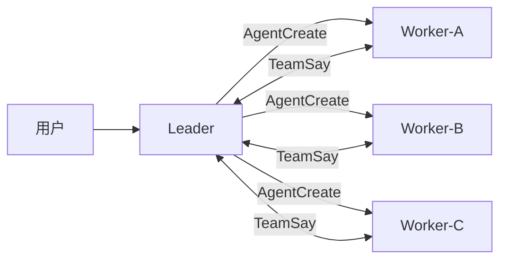
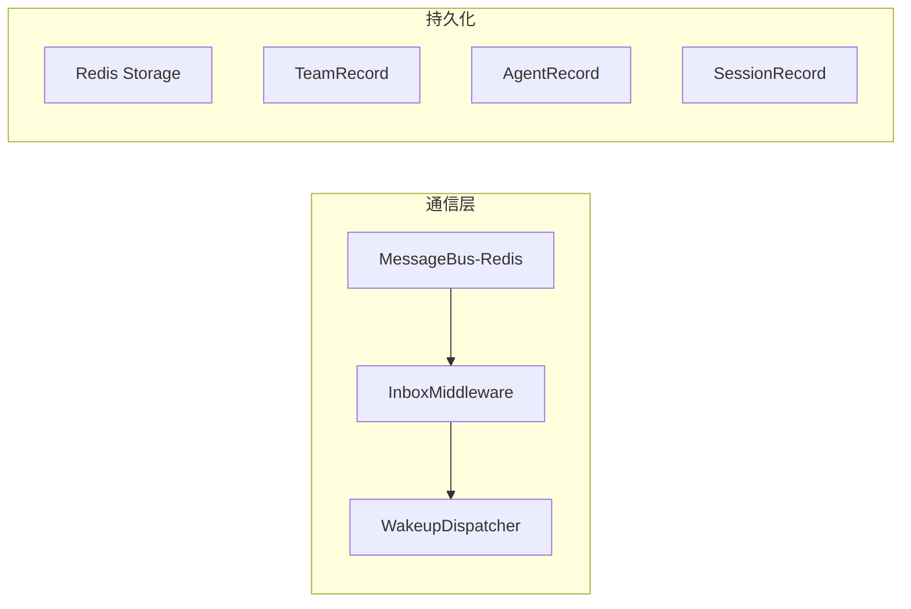
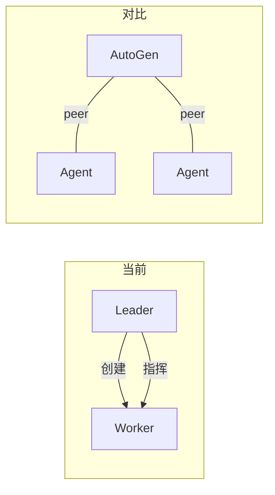

# AgentScope 2.0.1 Team Mode — 批判性分析

**日期:** 2025-07-14
**来源:** Issue #1422、PR #1776 源码、Team 文档、Service 文档

---

## 设计溯源

原始设计和实际交付之间存在明显落差：

### 原始设计（Issue [#1422](https://github.com/agentscope-ai/agentscope/issues/1422)）

```
主智能体 ──发布任务──→ 共享任务队列 ──认领──→ 子智能体
                                                │
子智能体 ──提交结果──→ 全局聚合队列 ←── 结果 ───┘
```

- 共享任务队列：publish / subscribe
- 子智能体异步认领并完成任务
- 结果提交到全局聚合队列
- 工具锁定机制防止资源冲突

### 实际交付（PR [#1776](https://github.com/agentscope-ai/agentscope/pull/1776)）



- Leader 动态创建 worker，无共享队列
- TeamSay 直接通信，星型拓扑
- 无任务认领/聚合机制
- 无工具锁定

**核心偏移**: 任务驱动 → Leader 驱动。

---

## 优点

### 基础设施扎实



- MessageBus + InboxMiddleware 约 150 行关键逻辑，复用已有调度原语
- Team、Agent、Session 存储模型完备
- Worker 在独立 session 中并发执行，非 leader 子协程

### LLM 友好接口

- 4 个 tool (TeamCreate/AgentCreate/TeamSay/TeamDelete) 对 LLM 自然
- 名称路由 `TeamSay(to="researcher")` 直观
- 角色感知描述减少误用

---

## 问题

### 1. Leader 霸权



Leader 同时拥有**创建权**和**协调权**，worker 不能预存在、不能复用。

### 2. 单一星型拓扑

当前通信模式：

```
Leader ←→ Worker-A
Leader ←→ Worker-B
Leader ←→ Worker-C
```

问题：
- Leader LLM 上下文窗口成为瓶颈
- 所有消息流经 Leader 导致上下文膨胀
- Leader 故障则团队停摆

### 3. 无任务编排层

| 能力 | 原始设计 | 实际交付 |
|------|---------|---------|
| 任务分发 | 共享队列 publish/subscribe | ❌ 无 |
| 结果聚合 | 全局聚合队列 | ❌ 无 |
| 资源锁 | 工具锁定 | ❌ 无 |
| 状态共享 | 共享黑板 | ❌ 无 |

### 4. Worker 生命周期绑定太紧

| 维度 | 当前行为 | 问题 |
|------|---------|------|
| 创建 | 只能由 leader 运行时创建 | 不能预创建 |
| 可见性 | `source="team"` 被 list_agents 过滤 | 用户无法在 UI 管理 |
| 删除 | 只能 TeamDelete 批量删除 | 无移除单个 worker 的 API |

### 5. 规模限制

- 团队信息嵌入 system prompt，更改需重建 worker
- 无 worker 心跳/存活检查
- Leader 需轮询事件流观察进度

---

## 与你的需求缺口

### 缺口 1：从模板创建 worker

```
当前: AgentCreate(name="researcher", description="...", prompt="...", permission_mode="...")
期望: AgentCreate(template="research-agent", params={...})
```

### 缺口 2：人组织团队

```
当前路径（唯一）:
  user → chat → Leader → AgentCreate → Worker

期望路径（至少两条）:
  ① user → API/UI → 创建预配置 agent（从模板）
  ② user → API/UI → 选择 leader + workers → 组成 team → 启动
```

### 缺口 3：Worker 直接通信

**当前**: Worker TeamSay 描述只写"发给 leader 或广播"
**实际**: 底层 `TeamSay(to="peer_name")` 已支持，只差改描述字符串

### 缺口 4：声明式任务分派

```
当前: AgentCreate(prompt="请搜索...") → AgentCreate(prompt="请写代码...")
期望: TaskQueue.publish("搜索任务") → workers 认领 → TaskQueue.collect_results()
```

---

## 评分

| 维度 | 评分 | 说明 |
|------|------|------|
| 基础设施 | 4/5 | MessageBus、Redis 存储、InboxMiddleware 扎实 |
| LLM 友好度 | 4/5 | 工具即协议，对 LLM 自然 |
| 任务协调 | 2/5 | 只有星型拓扑，无队列/聚合/锁定 |
| 声明式支持 | 1/5 | 完全是命令式，无声明式组队路径 |
| 可复用性 | 2/5 | Worker 不能预创建，不能从模板创建 |
| 可观察性 | 3/5 | 事件流+SSE 好，但无 worker 心跳 |
| 分布式支持 | 3/5 | 基础设施支持，但 leader 是单点瓶颈 |
| 外部集成 | 1/5 | 没有 REST API 来管理团队和 worker |

---

## 结论

AgentScope 2.0.1 Agent Team 是一个**以 LLM agent 为中心的最小可行实现**。选择了"4 tool + 消息总线"的极简路径，短期正确，长期有缺口。

**最大设计矛盾**: 底层数据模型（`TeamRecord.member_ids` 可容纳任意 agent）已为声明式组队做好准备，但工具层和 API 层硬编码了"leader 动态创建"的单一路径。基础设施超前、接口滞后。

**核心改动方向**:
1. 引入模板机制
2. 新增 RESTful Team API
3. 可选：任务队列抽象

---

## 来源

| # | 来源 | URL |
|---|------|-----|
| 1 | Original Design Issue #1422 | https://github.com/agentscope-ai/agentscope/issues/1422 |
| 2 | Agent Team Docs | https://docs.agentscope.io/zh/v2/deploy/agent-team |
| 3 | PR #1776 | https://github.com/agentscope-ai/agentscope/pull/1776 |
| 4 | Agent Service Docs | https://docs.agentscope.io/zh/v2/deploy/agent-service |
