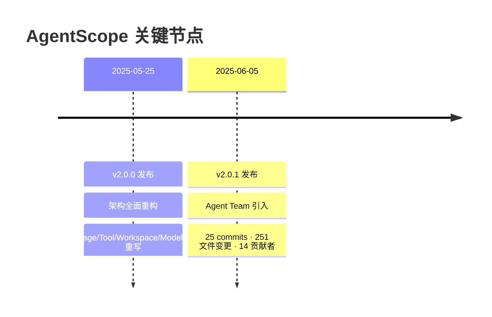
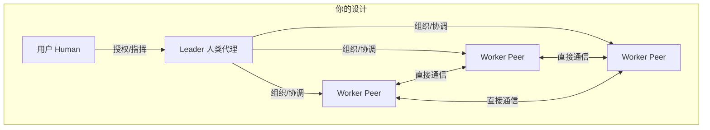
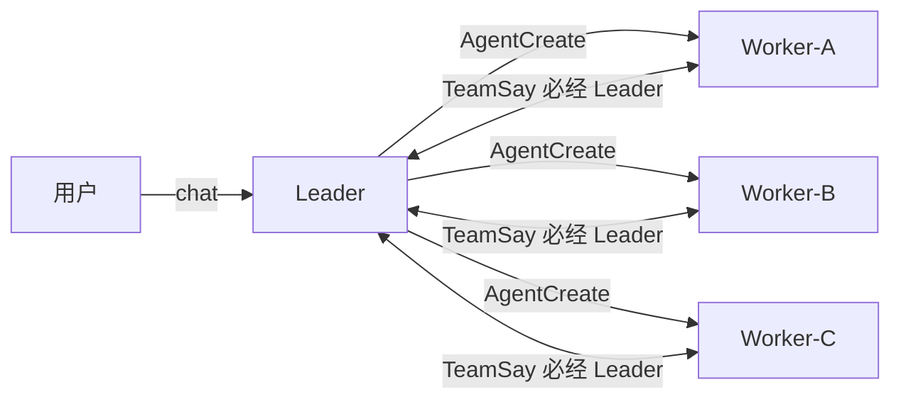
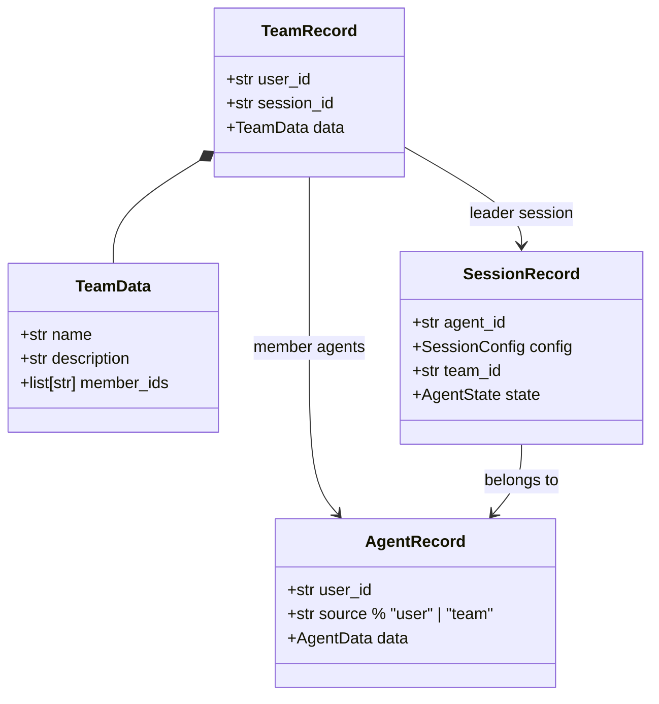
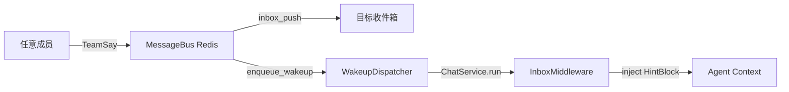
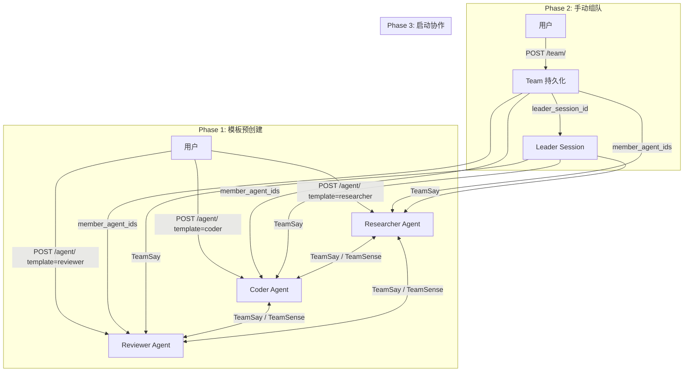
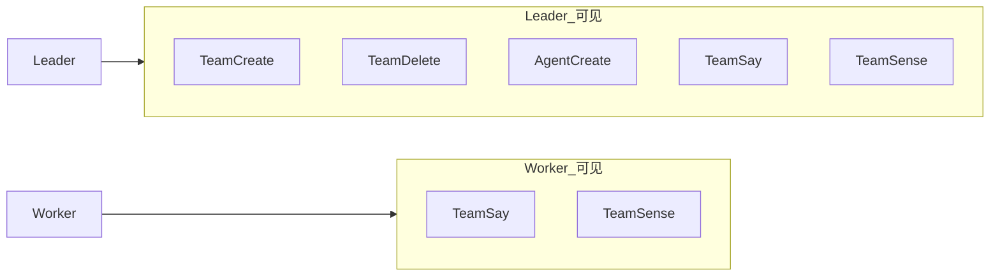

# AgentScope 2.0.1 Team Mode — 融合分析与理想设计

**日期:** 2025-07-14
**来源:** 6 个（v2.0.0/v2.0.1 release、原始 Issue #1422、PR #1776 源码、Team 文档、Service 文档、Changelog）

---

## 一、版本定位



v2.0.0 是架构革命，但没有多智能体能力。v2.0.1 在 11 天内补上 Agent Team，是一次**工程上的快速交付**，而非系统性架构设计。

---

## 二、你的设计哲学 vs 当前实现

### 你的三层模型



- **Leader = 人类代理**: 霸权来自授权，不是来自"我创造了你"
- **Worker = 平权同级**: 互相感知存在，直接通信协作
- **层级分明**: Worker 不能越权使用 Leader 级工具

### 当前实现



### 逐项对比

| 维度 | 你的设计 | 当前实现 | 差距 |
|------|---------|---------|------|
| Worker 来源 | 从模板预创建 | AgentCreate 动态创建 | **大** |
| 团队组建 | 人手动组织（API/UI） | Leader 运行时派生 | **大** |
| Leader 角色 | 人类代理，有授权霸权 | 创建者+协调者 | 中 |
| Worker 关系 | 平权 peer，互相通信 | 星型，经 Leader 中转 | **小** |
| 层级控制 | Worker 不能越权上级 | 无层级概念 | 中 |
| 任务分派 | 声明式（任务队列） | 命令式（逐个 prompt） | **大** |

---

## 三、源码架构分析

### 数据模型层（可以保留）



**关键**: `TeamRecord.member_ids` 是 `list[str]`——可以容纳任意 agent_id，不限于动态创建的 worker。**数据模型已经支持你的需求，只缺上层 API 来写入它。**

### 通信层（完全可复用）



**通信层不关心消息谁发的、发给谁——只认 session_id。** 星型、网状、层级拓扑都可以。

### 工具层（需要重构）

| 工具 | 当前行为 | 需要的变化 |
|------|---------|-----------|
| TeamCreate | 绑定 caller session 为 leader | 保留，新增 API 路径 |
| AgentCreate | 从零动态创建 worker | 可选：支持 template_id |
| TeamSay | 按名称路由，底层已支持 peer 寻址 | **改描述字符串即可** |
| TeamDelete | 批量删除所有 worker | 保留 |
| **TeamSense** | **不存在** | **新增**，让 worker 感知团队 |

---

## 四、三个核心洞察

### 洞察 1：Leader 霸权的两种来源

| | 当前实现 | 你的设计 |
|--|---------|---------|
| 霸权来源 | "我创造了你，所以我指挥你" | "人类选择了我代理决策" |
| 关系本质 | 创建者 → 被创建者 | 授权代理 → 被协调者 |
| 实际区别 | Worker 不能脱离 Leader 存在 | Worker 可以预存在，Leader 只是被授权组织 |

你的模型更健康——**霸权来自授权而非技术上的创建关系**。

### 洞察 2：Worker 平权模式只差一层纸

从源码确认，`TeamSay.__call__()` 内部构建**全成员目录**，不区分发送者角色：

```python
# _team_say.py 第 210 行
directory: dict[str, tuple[str, str]] = {
    leader_name: (leader_session.id, leader_session.agent_id),
}
for worker_agent_id in team.data.member_ids:
    directory[worker_agent.data.name] = (sessions[0].id, worker_agent_id)

# 按名称解析目标，不检查"发送者有没有权限发给这个人"
resolved = directory.get(to)  # 任何名字都可以
```

Worker 发给另一个 worker **技术上已是通的**。唯一的障碍是提示词没引导 LLM 这么做。

### 洞察 3：最大断层不在代码里，在路径上

```
当前路径（唯一）:
  chat → Leader → TeamCreate → AgentCreate → Worker

你需要的新增路径:
  REST API → 创建 agent（从模板）→ 手动组队 → 注入启动信号
```

两条路径可以并存。数据模型和通信层共用，入口不同。

---

## 五、理想架构

### 整体流程



### 角色与工具权限



### 新增：TeamSense 工具

```python
class TeamSense(_TeamToolBase):
    """感知团队成员的存在和状态。"""
    name: str = "TeamSense"
    description: """查询团队中所有成员的信息（名称、角色、状态）。
    让 worker 知道可以与谁协作、谁是 leader。"""

    async def __call__(self) -> ToolChunk:
        team = await self._storage.get_team(...)
        members = []
        for agent_id in team.data.member_ids:
            agent = await self._storage.get_agent(..., agent_id)
            session = await self._storage.get_session(...)
            members.append({
                "name": agent.data.name,
                "role": "worker",
                "status": session.state.status if session else "unknown",
            })
        members.append({"name": leader_name, "role": "leader", "status": "active"})
        return ToolChunk(content=[TextBlock(text=f"成员: {members}")])
```

### 提示词体系

```
Leader 版 TeamSay:
  "向特定 worker 派发任务，或广播给所有 worker。
   你是人类用户的代理，你的判断具有最终权威。"

Worker 版 TeamSay:
  "向同级 worker 发送消息，或向 leader 报告结果。
   你可以直接与同级协作，无需经过 leader 中转。
   注意：你不能创建/删除团队成员或解散团队。"

TeamSense（全员可见）:
  "查询团队中所有成员的信息，包括名称、角色和状态。
   用于感知协作对象，决定与谁通信。"
```

---

## 六、改造成本

```mermaid
gantt
    title 改造路线图
    dateFormat  X
    axisFormat  %d

    section P0 ~1天
    改 _WORKER_DESCRIPTION 引导 peer-to-peer     :0, 0.02d
    新增 TeamSense 工具                           :0.02d, 0.5d
    工具按角色注册（Leader/Worker 见不同工具集）    :0.5d, 1d

    section P1 ~2天
    新增 POST /team/ REST API                     :1d, 2d
    新增 Team CRUD 路由                           :2d, 3d

    section P2 ~2.5天
    引入 AgentTemplate 模型 + 模板 API             :3d, 5d
    松绑 source="team" 限制                       :5d, 5.5d

    section P3 ~5天
    TaskQueue 模型 + 任务分派工具                   :5.5d, 8.5d
    工具锁定机制                                   :8.5d, 10.5d
```

| 优先级 | 改动 | 工作量 | 效果 |
|--------|------|--------|------|
| **P0** | TeamSense + 描述修改 + 工具角色过滤 | **1 天** | Worker 平权通信 + 层级控制 |
| **P1** | POST /team/ API + Team CRUD | **2 天** | 人可以通过 API 手动组队 |
| **P2** | AgentTemplate 模型 + 模板 API | **2.5 天** | 从模板预创建 worker |
| **P3** | TaskQueue + 工具锁定 | **5 天** | 声明式任务分派 |

---

## 七、结论

AgentScope 2.0.1 的 Agent Team 提供了扎实的**地基**（MessageBus、Redis 存储、InboxMiddleware、并发执行），但**上层建筑**不符合你的需求。好消息是底层基础设施对拓扑中立，你可以保留它，替换工具层和 API 层。

**三个核心洞察回顾**:
1. **Leader 霸权可保留**——但来源应从"我创建了你"改为"人类授权了我"
2. **Worker 平权只差一层纸**——`TeamSay(to="peer_name")` 已支持，加 TeamSense + 改描述即可
3. **最大断层在路径不在代码**——数据模型已支持，缺 REST API

P0 做完（1 天），你的"平权 worker + 层级分明"核心模型就已可用了。

---

## 来源

| # | 来源 | URL |
|---|------|-----|
| 1 | Issue #1422 原始设计 | https://github.com/agentscope-ai/agentscope/issues/1422 |
| 2 | PR #1776 源码 | https://github.com/agentscope-ai/agentscope/pull/1776 |
| 3 | Team 文档 | https://docs.agentscope.io/zh/v2/deploy/agent-team |
| 4 | Service 文档 | https://docs.agentscope.io/zh/v2/deploy/agent-service |
| 5 | GitHub v2.0.1 Release | https://github.com/agentscope-ai/agentscope/releases/tag/v2.0.1 |
| 6 | GitHub v2.0.0 Release | https://github.com/agentscope-ai/agentscope/releases/tag/v2.0.0 |
